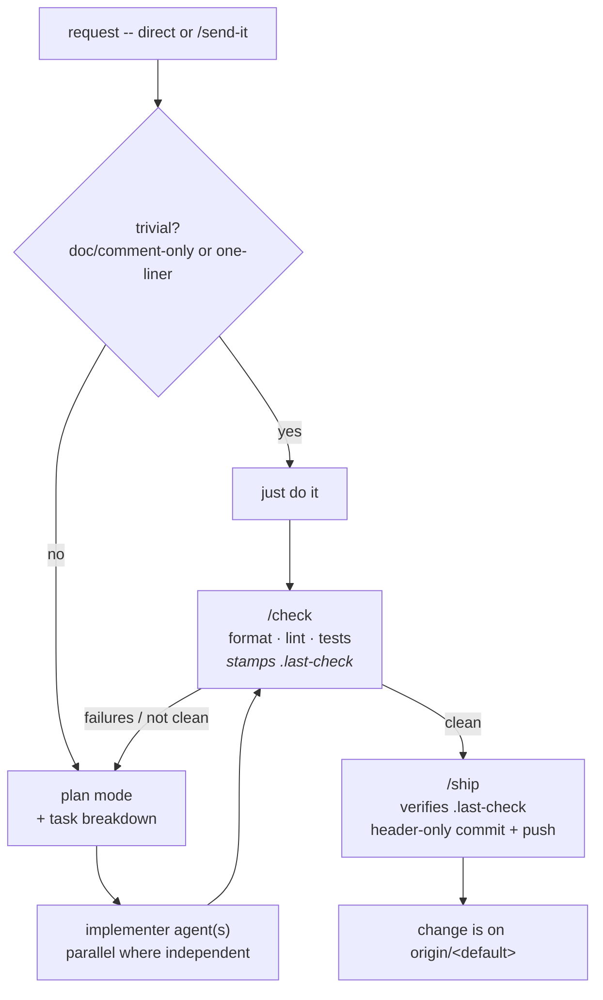

# How this workflow works

`str8-2-main` is the relaxed member of the workflow family. There is no work
branch, no issue or todo record, and no `PreToolUse` gate on edits. Three rules
hold -- and only the second is enforced by anything other than habit.

If you want a change traced to an issue or a tracked backlog, or a review pass
before code lands, use `issue-gated` or `todo-gated` instead. This one trades that
robustness away on purpose.

## 1. Non-trivial work goes through plan mode with a task breakdown

Run `/send-it <request>` -- or just make the request directly; a bare request
triggers the same flow. It enters plan mode, reads the code, and produces a plan
broken into isolated `### Task N` blocks that are mirrored to `TaskCreate` and
dispatched to the `implementer` agent (`.claude/agents/implementer.md`), in
parallel where the tasks are independent.

**Exemption:** a single-file pure documentation/comment edit, or a genuine
one-line fix, may skip formal plan mode -- state the change in a sentence and
proceed. Keep that bar genuinely small.

Every plan **must end with `/check`**. Nothing is checked while you write.

## 2. `/check` runs once per change, before `/ship`

**This is the only enforced rule.** `/check` (`.claude/commands/check.md`) runs in
two parts:

- **The formatter** is applied *in place* -- formatting has one correct answer, so
  it is fixed rather than reported. Skipped when the project has none.
- **Lint and tests** then run. The `format` / `lint` / `test` commands and the
  source-file glob (`find_expr`) all come from `.claude/project.json`. Any
  failure aborts the change until fixed. On pass it stamps a source-tree hash to
  `.claude/.last-check`.

There is no review pass and no `reviewer` agent. If you want a structural review
before shipping, ask for one explicitly.

`/ship` recomputes that hash and refuses to run if it does not match -- so a
change cannot reach `origin` without a green `/check`.

## 3. `/ship` commits and pushes to the default branch

`git commit` and `git push` are **not** denied in this workflow. `/ship`
(`.claude/commands/ship.md`) confirms `/check` is current, stages only the files
the change touched, commits, and pushes -- straight to the default branch.

## Commit convention

- **No work branch.** Everything happens on the default branch.
- **Header-only commit messages:** a single line `type: Sentence-case description`
  (`feat` / `fix` / `refactor` / `docs` / `test` / `chore`), optional scope
  `fix(build):`. No body. No `Co-Authored-By` trailer. No session or attribution
  trailer of any kind.
- One logical change per commit.

## Lifecycle

## Common commands

| Command | What it does |
|---|---|
| `/send-it <request>` | Enter plan mode, break the work into tasks, dispatch `implementer`(s). Also how a bare request is handled. |
| `/check` | Formatter, lint, tests, then stamp `.claude/.last-check`. |
| `/ship` | Confirm `/check` is current, stage the changed files, header-only commit, push to the default branch. |
