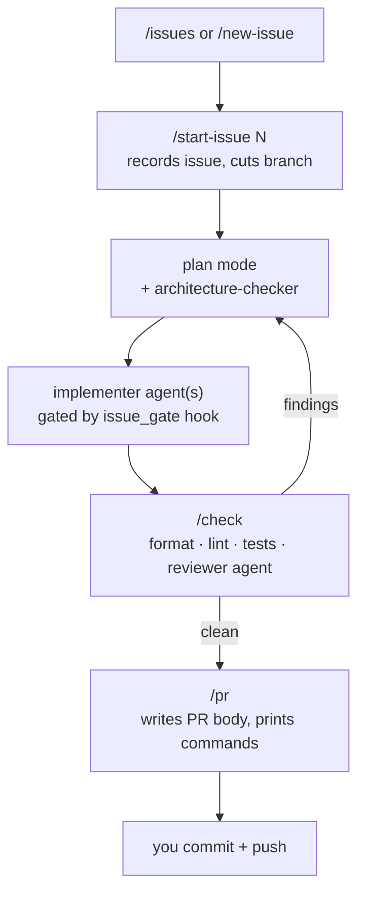
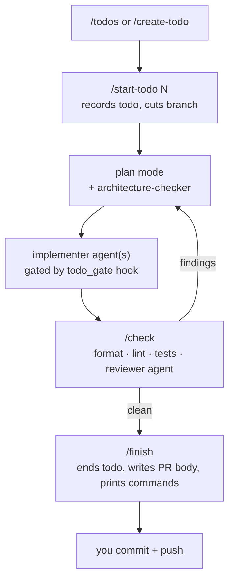
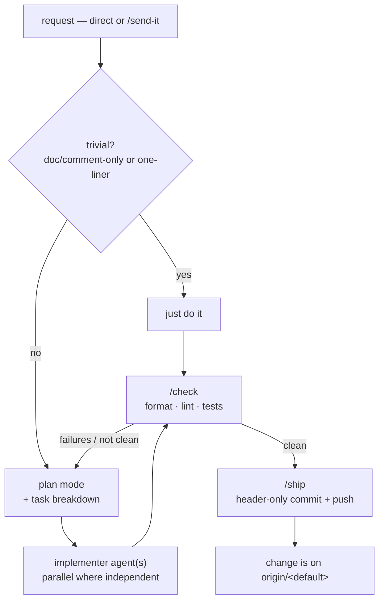

# Workflows

Each subdirectory here has a **`core/`** (hooks, commands, agents, docs -- the
invariant part, identical for every repo running the workflow) and a **`local/`**
(templates a repo fills in and owns). A repo adopts a workflow by symlinking
`core/` into its `.claude/` and copying `local/` in; upgrades to `core/`
propagate to every adopter through the symlink. `workflows/_shared/` holds files
shared *between* workflows, symlinked into each `core/`.

## Incorporating a workflow into a project

1. Make `bin/wf` reachable (once per machine):

   ```bash
   ln -s /path/to/claude-toolkit/bin/wf ~/.local/bin/wf   # or anywhere on PATH
   ```

2. Adopt the workflow (swap in `todo-gated` / `str8-2-main` as needed):

   ```bash
   cd your-project
   wf adopt issue-gated
   ```

   This creates `.claude/`, symlinks `core/` in, copies the `local/` templates,
   writes `.claude/.workflow`, and registers the repo. It refuses if `.claude/`
   already exists and is non-empty -- merge by hand in that case.

3. Open Claude Code in the project and say: **"read `.claude/INIT.md` and follow it"**.

4. Answer its questions. It fills `.claude/project.json` (source glob,
   format/lint/test commands, workflow knobs) and `.claude/settings.local.json`
   (the repo's lint/test allows, and -- for `issue-gated` -- `GH_REPO`), fills
   `ARCHITECTURE.md` if you gave rules, then deletes `INIT.md`. It never touches
   `core/` -- the default branch is derived at runtime, not configured.

5. Commit the real files (`.claude/project.json`, `.claude/settings.local.json`,
   `.claude/.workflow`, `.claude/CLAUDE.md`, and `ARCHITECTURE.md` /
   `todos.json` where present). The symlinks are gitignored.

6. Read `.claude/WORKFLOW.md`, and start with the entry command --
   `issue-gated`: `/issues` or `/new-issue`; `todo-gated`: `/todos` or
   `/create-todo`; `str8-2-main`: `/send-it`, or just make a request.

On a fresh clone of an already-adopted repo, run `wf link` to recreate the
symlinks from `.claude/.workflow`.

## Keeping adopted repos in sync

The symlinked `core/` is always live -- pull this toolkit and every adopter has
the new `core/`. What needs tracking is changes that require a repo to *do*
something (a new `project.json` key, a `settings.local.json` entry, a re-`wf
link`). Those go in each workflow's `MIGRATIONS.md` as a dated
`v<N> -> v<N+1>` block, and the workflow's `VERSION` is bumped.

```bash
wf sync                 # git-pull the store, then show every repo that is behind
wf status <repo>        # just the pending MIGRATIONS.md blocks for one repo
wf sync --accept <repo> # after working through them, record the new version
```

A pure-prose `core/` edit adds no `MIGRATIONS.md` block and needs no `wf sync`
follow-up.

---

## `issue-gated`

Every change traces to a GitHub issue, goes through plan mode, is implemented by
scoped subagents, and passes a local check sweep + a read-only review before it can
become a PR. Claude never commits or pushes — `/pr` hands you the commands. A
`PreToolUse` hook denies edits to tracked files until an issue is recorded for the
current branch; a `Stop` hook flags when workflow changes outrun the docs; an
optional architecture check runs against your rules *before* code is written.



**Use it when:**

- Solo or small-team work on a GitHub repo where you want every change linked to an
  issue and a clean issue → branch → PR trail.
- You want plan-mode discipline and a forced local check + review gate before PR.
- You want to keep `commit`/`push` a deliberate human step.

**Don't bother when:**

- Throwaway scripts, spikes, or repos without GitHub issues.
- A team that already has heavier CI/CD process this would duplicate or fight.
- You want Claude to commit and push autonomously.

---

## `todo-gated`

`issue-gated` without GitHub. Every change traces to a row in a version-controlled
`.claude/todos.json` backlog (managed only through `.claude/scripts/todos.py`, never
hand-edited), goes through plan mode, is implemented by scoped subagents, and passes
a local check sweep + a read-only review before it becomes a PR. Claude never
commits or pushes — `/finish` closes the todo and hands you the commands. A
`PreToolUse` hook denies edits to tracked files until `/start-todo` records a todo
for the current branch (the active session lives in a gitignored
`.claude/.current-todo`, so the tracked backlog doesn't churn between branches); a
`Stop` hook flags when workflow changes outrun the docs; an optional architecture
check runs against your rules *before* code is written.



**Use it when:**

- Local or solo work on a repo with no GitHub issues, or where you don't want an
  issue filed per change.
- You want the work backlog to live in the repo and travel with it.
- You want `issue-gated`'s plan-mode + check + review discipline without a GitHub
  dependency.

**Don't bother when:**

- You already track work as GitHub issues — use `issue-gated`.
- Throwaway scripts and spikes.
- You want Claude to commit and push autonomously.

---

## `str8-2-main`

The relaxed one, for people who push straight to `main` and hand Claude direct
requests. No issue or todo record, no work branch, no `PreToolUse` edit gate, no
review pass, no architecture check, no doc-drift hook. What it keeps: non-trivial
work still goes through **plan mode with a task breakdown**, and **`/check`
(format · lint · tests) is a hard gate before anything ships**. Unlike the other
two, `git commit`/`git push` are *not* denied — `/ship` verifies `/check` is
current, makes a header-only commit (`type: description`, no body, no trailers),
and pushes to the default branch itself. A `SessionStart` hook restates the mode
and the uncommitted-file count; that is the only hook.



**Use it when:**

- Solo work you push straight to `main`, with no issue or backlog bookkeeping and
  no work branch.
- You still want plan-mode discipline and a forced check gate before code lands.
- You are fine with Claude committing and pushing to `main` once `/check` is clean.

**Don't bother when:**

- You want a change traced to an issue or a tracked backlog — use `issue-gated` or
  `todo-gated`.
- A shared repo where landing straight on `main` without review would step on
  people.
- You want `commit`/`push` to stay a deliberate human step — the other two do that.
