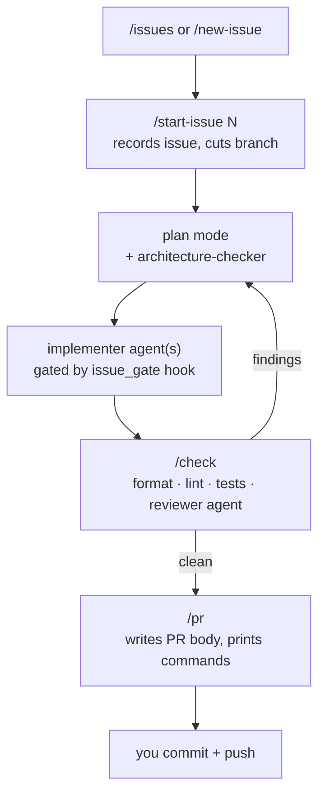

# Workflows

Each subdirectory here is a complete, self-contained `.claude/` folder — hooks,
commands, agents, and docs that together impose one way of working on a repo. They
are generic: nothing is wired to a specific project until you run the workflow's
`INIT.md`.

## Incorporating a workflow into a project

1. Copy the workflow directory into your project and rename it to `.claude/`:
   ```bash
   cp -r /path/to/claude-toolkit/workflows/issue-gated your-project/.claude
   ```
   If the project already has a `.claude/`, copy the pieces in by hand, or drop the
   workflow in a scratch dir and merge — don't clobber existing config.
2. Open Claude Code in the project and say: **"read `.claude/INIT.md` and follow it"**.
3. Answer its questions. It inspects the repo, fills in the project specifics
   (repo slug, default branch, format/lint/test commands, source paths, architecture
   rules), then deletes `INIT.md`.
4. Read `.claude/WORKFLOW.md` for how it operates, and start with `/issues` or
   `/new-issue`.

Same steps for a brand-new project or an existing one — the only difference is
whether step 1 is a plain copy or a merge.

---

## `issue-gated`

Every change traces to a GitHub issue, goes through plan mode, is implemented by
scoped subagents, and passes a local check sweep + a read-only review before it can
become a PR. Claude never commits or pushes — `/pr` hands you the commands. A
`PreToolUse` hook denies edits to tracked files until an issue is recorded for the
current branch; a `Stop` hook flags when workflow changes outrun the docs; an
optional architecture check runs against your rules *before* code is written.



**Use it when:**
- Solo or small-team work on a GitHub repo where you want every change linked to an
  issue and a clean issue → branch → PR trail.
- You want plan-mode discipline and a forced local check + review gate before PR.
- You want to keep `commit`/`push` a deliberate human step.

**Don't bother when:**
- Throwaway scripts, spikes, or repos without GitHub issues.
- A team that already has heavier CI/CD process this would duplicate or fight.
- You want Claude to commit and push autonomously.
