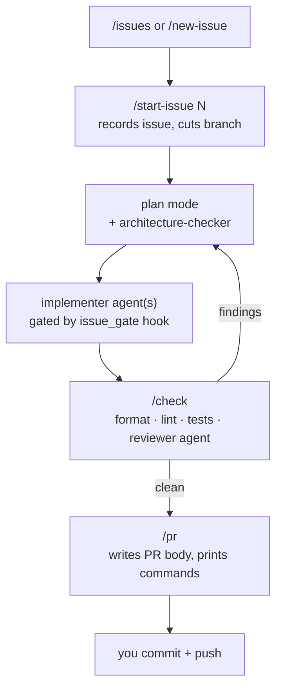
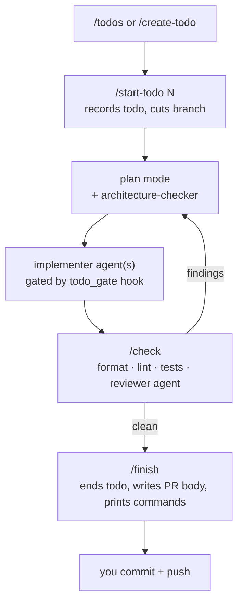
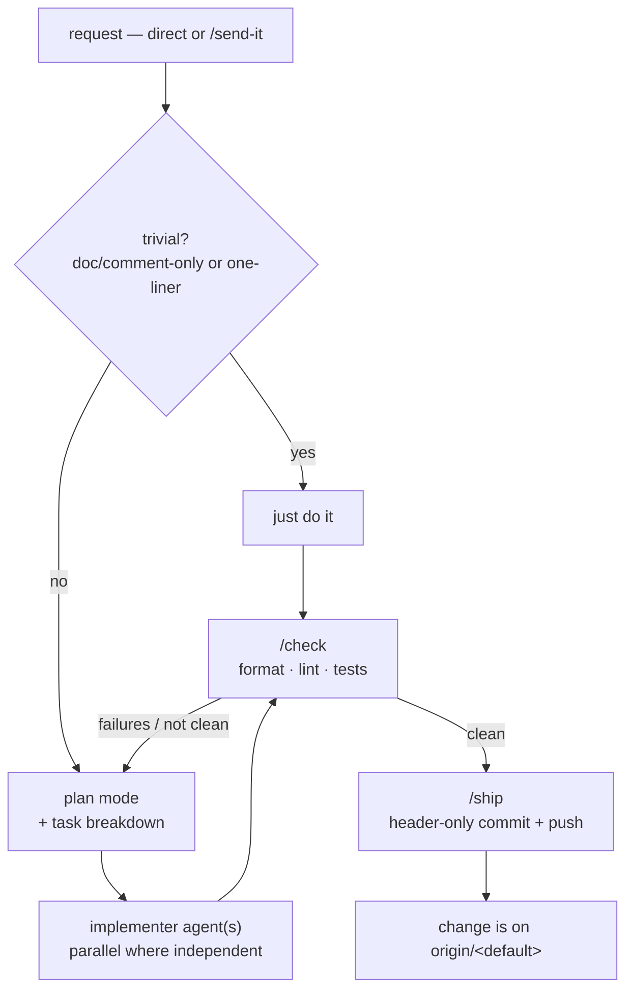

# Workflows

Each subdirectory here has a **`core/`** (hooks, commands, agents, docs -- the
invariant part, identical for every repo running the workflow) and a **`local/`**
(templates a repo fills in and owns). A repo adopts a workflow by copying
`core/` and `local/` into its `.claude/` as real, committed files -- adopters
are self-contained, not linked back to this store. `workflows/_shared/` holds
files shared *between* workflows, symlinked into each `core/` (store-internal
only; adopters always get real file content, never a symlink).

## Incorporating a workflow into a project

1. Make `bin/wf` reachable (once per machine) -- see the root
   [`README.md`](../README.md) for where to put this repo and the PATH setup.

2. Adopt the workflow (swap in `todo-gated` / `str8-2-main` as needed):

   ```bash
   cd your-project
   wf adopt issue-gated
   ```

   This creates `.claude/`, copies `core/` and the `local/` templates in as
   real files, writes `.claude/.workflow` (which also tracks a hash of every
   core file, for `wf sync` later), and registers the repo. It refuses if
   `.claude/` already exists and is non-empty.

   For a repo that **already has a non-empty `.claude/`** (a hand-rolled setup,
   or one adopted before the `core/`/`local/` split), you have two choices:

   - `wf adopt <workflow> --force` -- installs the **full** workflow over the
     existing `.claude/`, exactly as a fresh `adopt` would: every core file is
     written, `INIT.md` is dropped in, and `core_version` is set to the current
     `VERSION`. A pre-existing file a core file would overwrite is kept as
     `<file>.pre-adopt` for you to diff and delete. Non-core files (your own
     custom commands) are untouched.
   - `wf link <workflow>` -- the light touch: writes `.claude/.workflow`, fills
     only genuinely-missing files, registers the repo, records `core_version 0`
     so every pending `MIGRATIONS.md` block still surfaces. No `INIT.md`. Run
     `wf diff` afterward to see what diverged and fix it by hand.

   Neither splits a flat hand-rolled `settings.json` into core/local for you.
   Under `--force` that file lands at `settings.json.pre-adopt` (core now owns
   `settings.json`); move its `permissions.allow` entries and `GH_REPO` into
   `.claude/settings.local.json`. Under `link` it stays put and `wf diff` flags
   it.

3. Open Claude Code in the project and say: **"read `.claude/INIT.md` and follow it"**.

4. Answer its questions. It fills `.claude/project.json` (source glob,
   format/lint/test commands, workflow knobs) and `.claude/settings.local.json`
   (the repo's lint/test allows, and -- for `issue-gated` -- `GH_REPO`), fills
   `ARCHITECTURE.md` if you gave rules, then deletes `INIT.md`. It never touches
   `core/` -- the default branch is derived at runtime, not configured.

5. Commit everything, including `core/`'s real files (`.claude/commands/`,
   `.claude/agents/`, `.claude/hooks/`, `.claude/WORKFLOW.md`,
   `.claude/settings.json`, `.claude/.workflow`) and the `local/` ones
   (`.claude/project.json`, `.claude/settings.local.json`, `.claude/CLAUDE.md`,
   and `ARCHITECTURE.md` / `todos.json` where present). Nothing under
   `.claude/` is gitignored anymore -- the repo now owns real copies.

6. Read `.claude/WORKFLOW.md`, and start with the entry command --
   `issue-gated`: `/issues` or `/new-issue`; `todo-gated`: `/todos` or
   `/create-todo`; `str8-2-main`: `/send-it`, or just make a request.

## Keeping adopted repos in sync

Pulling this toolkit does not by itself change an adopter -- `core/` is
copied, not linked. Run `wf sync` to reconcile: for each core file it
compares what the repo last synced, what the store has now, and what's on
disk in the repo, then per file either copies in an untouched update, leaves
a locally-edited file alone, or -- when both sides changed the same file --
leaves the repo's file untouched and writes the store's version alongside it
as `<file>.core-new` to merge by hand (delete it once merged; the next sync
clears the conflict on its own).

Changes that also need a repo to *do* something beyond a file copy (a new
`project.json` key, a `settings.local.json` entry) go in each workflow's
`MIGRATIONS.md` as a dated `v<N> -> v<N+1>` block, and the workflow's
`VERSION` is bumped.

```bash
wf sync                 # git-pull the store, then REPORT only (writes nothing)
wf sync <repo> [...]    # pull, then reconcile the named repo(s)
wf sync --all           # pull, then reconcile every registered repo
wf status <repo>        # one repo's sync state + pending MIGRATIONS.md, no pull
wf sync --accept <repo> # after a MIGRATIONS.md block, record the new version
wf diff <repo>          # unified diff of every core file this repo has edited
wf backport <repo> <relpath>  # copy that edited core file back onto the store source
```

A bare `wf sync` reports and writes nothing: opening any adopted repo enrolls
it in the registry (via the `SessionStart` notify hook), so a blanket
reconcile would rewrite `.claude/` in repos you aren't working in. Name the
repo, or pass `--all`, to actually apply.

`wf diff` / `wf backport` are the path for a fix you made ad hoc in one repo:
`wf diff` shows it, `wf backport` copies it onto the store's `core/` (or, for a
`_shared/` file, every workflow at once -- it warns you). Neither commits or
bumps `VERSION`; review `git diff` in the store, add a `MIGRATIONS.md` block if
adopters must act, commit, then `wf sync` propagates it.

A pure-prose `core/` edit adds no `MIGRATIONS.md` block and needs no
`--accept` -- `wf sync <repo>` alone picks up the file change.

Every adopted repo also runs a `SessionStart` hook (`workflow_notify.py`, v2+)
that says when the repo is behind the store or the store clone is stale. It
only reports; you still run `wf sync` yourself. It needs `bin/wf` on PATH.

---

## `issue-gated`

Every change traces to a GitHub issue, goes through plan mode, is implemented by
scoped subagents, and passes a local check sweep + a read-only review before it can
become a PR. Claude never commits or pushes — `/pr` hands you the commands. A
`PreToolUse` hook denies edits to tracked files until an issue is recorded for the
current branch; a `Stop` hook flags when workflow changes outrun the docs; an
optional architecture check runs against your rules *before* code is written.



**Use it when:**

- Solo or small-team work on a GitHub repo where you want every change linked to an
  issue and a clean issue → branch → PR trail.
- You want plan-mode discipline and a forced local check + review gate before PR.
- You want to keep `commit`/`push` a deliberate human step.

**Don't bother when:**

- Throwaway scripts, spikes, or repos without GitHub issues.
- A team that already has heavier CI/CD process this would duplicate or fight.
- You want Claude to commit and push autonomously.

---

## `todo-gated`

`issue-gated` without GitHub. Every change traces to a row in a version-controlled
`.claude/todos.json` backlog (managed only through `.claude/scripts/todos.py`, never
hand-edited), goes through plan mode, is implemented by scoped subagents, and passes
a local check sweep + a read-only review before it becomes a PR. Claude never
commits or pushes — `/finish` closes the todo and hands you the commands. A
`PreToolUse` hook denies edits to tracked files until `/start-todo` records a todo
for the current branch (the active session lives in a gitignored
`.claude/.current-todo`, so the tracked backlog doesn't churn between branches); a
`Stop` hook flags when workflow changes outrun the docs; an optional architecture
check runs against your rules *before* code is written.



**Use it when:**

- Local or solo work on a repo with no GitHub issues, or where you don't want an
  issue filed per change.
- You want the work backlog to live in the repo and travel with it.
- You want `issue-gated`'s plan-mode + check + review discipline without a GitHub
  dependency.

**Don't bother when:**

- You already track work as GitHub issues — use `issue-gated`.
- Throwaway scripts and spikes.
- You want Claude to commit and push autonomously.

---

## `str8-2-main`

The relaxed one, for people who push straight to `main` and hand Claude direct
requests. No issue or todo record, no work branch, no `PreToolUse` edit gate, no
review pass, no architecture check, no doc-drift hook. What it keeps: non-trivial
work still goes through **plan mode with a task breakdown**, and **`/check`
(format · lint · tests) is a hard gate before anything ships**. Unlike the other
two, `git commit`/`git push` are *not* denied — `/ship` verifies `/check` is
current, makes a header-only commit (`type: description`, no body, no trailers),
and pushes to the default branch itself. A `SessionStart` hook restates the mode
and the uncommitted-file count; a second `SessionStart` hook
(`workflow_notify.py`) reports when the toolkit store has run ahead of the repo.



**Use it when:**

- Solo work you push straight to `main`, with no issue or backlog bookkeeping and
  no work branch.
- You still want plan-mode discipline and a forced check gate before code lands.
- You are fine with Claude committing and pushing to `main` once `/check` is clean.

**Don't bother when:**

- You want a change traced to an issue or a tracked backlog — use `issue-gated` or
  `todo-gated`.
- A shared repo where landing straight on `main` without review would step on
  people.
- You want `commit`/`push` to stay a deliberate human step — the other two do that.
