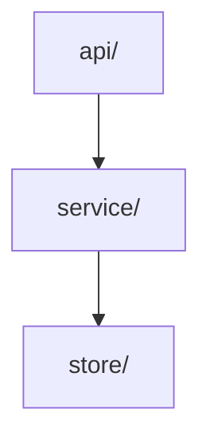

<!-- ARCHITECTURE-TEMPLATE-UNFILLED -->
<!--
  This file is the architecture contract the `architecture-checker` agent reads
  during `/start-issue`'s plan step, before any code is written. It checks the
  proposed plan against the rules below and hands back violations plus
  architecture-preserving alternatives.

  While this marker line is present (and the Rules section has no concrete rules),
  `architecture-checker` no-ops — it will not invent rules. Fill in the rules for
  your project and delete the marker and these examples. If your project has no
  architecture worth guarding, leave the file as-is; the workflow works without it.
-->

# Architecture

One paragraph describing the shape of this codebase — its main modules/layers and
how they relate. Keep it short; the Rules below are the part that matters.

## Rules

The rules are the actual architecture. Each is a clause `architecture-checker` can
check a plan against. Write them as concrete, checkable statements — name real
modules/directories, say what may and may not depend on what.

Example rules (replace with your own):

1. **Dependencies point one way.** `api/` → `service/` → `store/`. Nothing in
   `store/` imports from `service/` or `api/`; nothing in `service/` imports from
   `api/`.
2. **Business rules live in `service/`, not in handlers.** `api/` handlers parse
   the request, call one service function, and serialise the result — no
   domain logic, no direct `store/` access.
3. **Cross-module state is passed, not reached for.** A module receives what it
   needs as an argument; it does not import a shared singleton or read global
   config directly.

## Dependency Diagram

