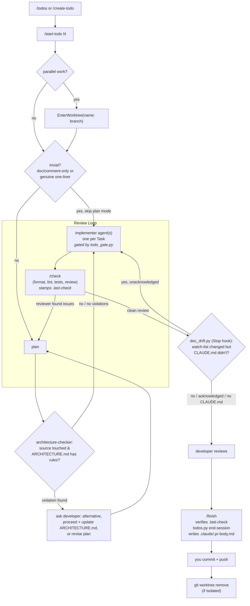

# How this workflow works

Five rules hold in a repo using this workflow. The first three are enforced
mechanically; the last two are enforced by an agent's judgement, with a hook
backstop for rule 4.

This is `issue-gated` without GitHub: the unit of work is a row in a
version-controlled `.claude/todos.json` backlog instead of a GitHub issue.

## 1. No change without a tracked todo

Every change traces to an entry in `.claude/todos.json`.

**Enforcement:** `.claude/hooks/todo_gate.py` runs as a `PreToolUse` hook on
`Edit|Write` and *denies* the edit unless `.claude/.current-todo` records a todo for
the current branch. It also refuses any edit made while on the default branch,
refuses a record written for a different branch, and refuses a direct `Edit`/`Write`
on `.claude/todos.json` itself (that file changes only through
`.claude/scripts/todos.py`).

Run `/start-todo <id> [more...]` to open the gate. One branch may carry several
todos — record them all.

**Direct prompts, not just `/start-todo`.** A change requested directly, with no
todo on record, gets the same treatment `/create-todo` gives: the `todo-drafter`
agent (`.claude/agents/todo-drafter.md`) is dispatched to draft and append the
todo(s), then the user runs `/start-todo` on the result — never a silent edit
straight from the request.

Deliberately not gated: paths outside the repo, and `.claude/**` except
`todos.json` (otherwise this configuration could never be repaired). Known gap: the
gate covers `Edit`/`Write`, not shell redirection through `Bash`.

## 2. Checks run once per change, at `/check`

**Enforcement:** `/check` is the final step of every plan. It runs in three parts:

- **The formatter** is applied *in place* — formatting has one correct answer, so
  it is fixed rather than reported. Skipped when the project has none.
- **Lint and tests** then run. The `format` / `lint` / `test` commands and the
  source glob (`find_expr`) all come from `.claude/project.json`. Any failure
  aborts the change until fixed. On pass it stamps a source-tree hash to
  `.claude/.last-check`.
- **The `reviewer` agent** (`.claude/agents/reviewer.md`) then runs a read-only pass
  over the branch's source diff — structure, efficiency, long-term validity,
  isolation of units and behavior — once the checks above have passed. Skipped when
  the diff touches no source. It reports findings; it does not edit.

**Plan mode has a narrow exemption.** A single-file edit that is purely
documentation/comment text, or a genuine one-line fix, may skip formal plan mode —
state the change in a sentence and proceed.

There is deliberately **no `PostToolUse` hook on `Edit|Write`**: nothing is checked
while you write. (The one `PostToolUse` hook, `validate_todos_json.py`, only
re-validates `todos.json` after a `todos.py` call — it does not touch your code.)

## 3. Claude never commits or pushes

`git commit` and `git push` are in `permissions.deny` in `.claude/settings.json`,
for both the Bash and PowerShell tools. Staging, branching, diff and log remain
available. `/finish` closes out the todo, prepares the PR body, and hands the
commit/push commands back to you.

---

## 4. CLAUDE.md is checked against reality

*(Only relevant if the repo has a `.claude/CLAUDE.md`.)*

CLAUDE.md makes claims that go stale silently: which hooks are wired, which commands
exist, how checks are enforced. Each claim has a file behind it.

The primary mechanism is the **plan**: `/start-todo` requires every plan to say
whether the change earns a CLAUDE.md update, so documentation is written with the
code rather than bolted on.

**Backstop:** `.claude/hooks/doc_drift.py` runs as a `Stop` hook. It compares the
branch's changed files against a watch list (`.claude/settings.local.json`,
`.claude/project.json`, `.claude/scripts/`, `.claude/ARCHITECTURE.md`, plus any
paths in `project.json`'s `doc_drift_watch`) and, when any of those changed but
`.claude/CLAUDE.md` did not, blocks the stop with the list. The
`.claude/commands/`, `.claude/agents/`, `.claude/hooks/` trees are symlinks into
the shared store, so their edits are tracked in the store, not here. It fires
once per distinct set of changes, recorded in `.claude/.doc-drift-ack`
(gitignored). If the repo has no `.claude/CLAUDE.md`, the hook does nothing.

---

## 5. Architecture is checked before implementation, not after

*(Only active once `.claude/ARCHITECTURE.md` has real rules — see that file.)*

`.claude/ARCHITECTURE.md`'s rules are the architecture contract. A naturally phrased
request breaks them easily, and nothing else catches that before the code exists.

**Enforcement:** the `architecture-checker` agent
(`.claude/agents/architecture-checker.md`) is dispatched once per plan during
`/start-todo`'s plan step, before `ExitPlanMode`, whenever the plan touches source.
It reads the plan's proposed changes against `ARCHITECTURE.md`'s rules and hands
back any violation, why the rule holds, and a concrete architecture-preserving
alternative. `AskUserQuestion` is unavailable inside subagents, so it hands the
finding back; the main agent asks the developer which way to go — including
proceeding as planned and updating `ARCHITECTURE.md` instead — and folds the answer
into the plan before presenting it.

---

## The todo backlog

`.claude/todos.json` is the tracked backlog and travels with the repo. It is only
ever changed through `.claude/scripts/todos.py` (pure stdlib, no dependencies) —
`todo_gate.py` denies direct edits. Subcommands:

| Subcommand | Used by | What it does |
|---|---|---|
| `add --header H --description D [--subtask S ...]` | `todo-drafter`, you (manual grooming) | append a backlog item |
| `list [--status S] [--json]` | `/todos`, `/start-todo`, `reviewer` | read backlog / in-progress items |
| `start-session <ids> <branch>` | `/start-todo` | flip todos to `in_progress`, write `.claude/.current-todo` |
| `set-plan <id> "<text>"` | `/start-todo` | store the approved plan on the todo |
| `update-status <id> <status>` | you (manual grooming) | move an item between `backlog` / `in_progress` / `completed` |
| `end-session` | `/finish` | mark active todos + open subtasks `completed`, delete `.claude/.current-todo` |
| `validate` | `validate_todos_json.py` hook | schema-check the file |

**Scoping convention (load-bearing):** a todo item is one Claude session. Separable
pieces within that session are subtasks. Work spanning more than one session is
several top-level todos. `todo-drafter` applies this when drafting.

The active session — which todo(s) and branch the gate is open for — lives in the
gitignored `.claude/.current-todo`, *not* in `todos.json`, so the tracked backlog
does not churn or conflict between branches.

## Lifecycle

Parallel todos run as separate sessions, each entering its own worktree via
`/start-todo` — not one session juggling several.

## Common commands

| Command | What it does |
|---|---|
| `/todos [filter]` | List backlog + in-progress items to pick from |
| `/create-todo <description>` | Draft new backlog item(s) — also how Claude handles a direct prompt with no todo on record |
| `/start-todo <id> [id...]` | Record the todo(s), cut a `<type>/<kebab-description>` branch, write `.claude/.current-todo`, enter plan mode |
| `/check` | Formatter, lint, tests, then a `reviewer` pass over the source diff, stamping `.claude/.last-check` |
| `/finish` | Confirm `/check` is current, `todos.py end-session`, write `.claude/.pr-body.md`, print the commit/push commands |

## Branch and commit conventions

- Branches: `<type>/<kebab-description>` — `feat/`, `fix/`, `refactor/`, `chore/`,
  `docs/`, `test/`. Match whatever the repo's history already uses.
- Commits / PR titles: `type: Sentence-case description`. Optional scope:
  `fix(build):`.
- The `todos.json` backlog update ships in the same commit as the code it closes.
